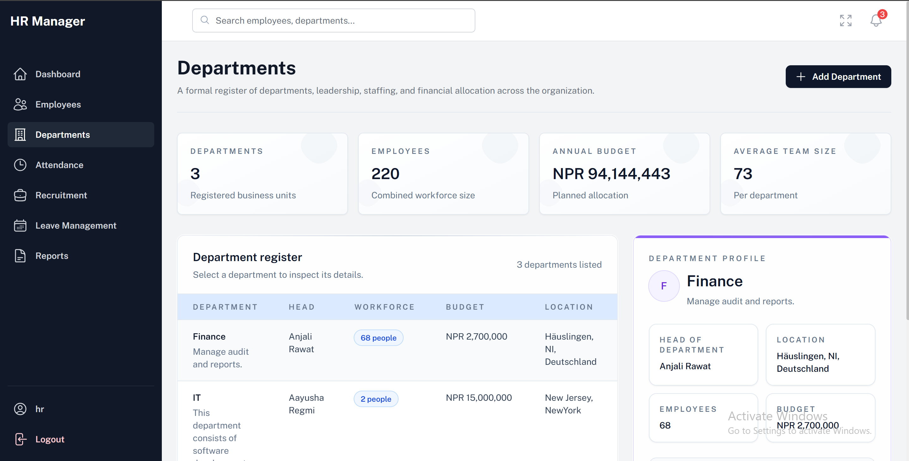

# HRM System

A highly resilient Human Resource Management (HRM) application engineered with a high-performance **FastAPI backend** and a modular **React (Vite) frontend**. The system handles core enterprise operational workflows including authentication, granular employee and department management, automated attendance tracking, leave requests, dynamic job boards, real-time WebSocket notifications, and enterprise system configuration.

---

## System Architecture & Interface Overview



```text
+--------------------------------------------------------------------------+
|  [React + Vite Frontend]  =======>  [Nginx Edge Proxy] =======> [FastAPI] |
|        (Port 80)                       (Port 80)              (Port 8000)|
+--------------------------------------------------------------------------+
```

The workspace is organized into distinct layer responsibilities:
*   `client/`: React production single-page application built on Vite and styled via Tailwind CSS.
*   `server/`: FastAPI service driving core CRUD logic, SQLAlchemy models, and API routers.
*   `migrations/` and `alembic.ini`: Alembic schema migrations for database versioning.
*   `docker-compose.yml`: Local Docker Compose stack for the application and database.
*   `k8s/`: Kubernetes deployment assets, including the Helm chart package and local Kind-based manifests.

---

## Project Structure

```text
HRM/
├── client/
│   ├── Dockerfile
│   ├── nginx/
│   │   └── default.conf
│   ├── public/
│   └── src/
├── docs/
│   └── images/
├── k8s/
│   ├── base/
│   │   ├── client/
│   │   ├── mysql/
│   │   └── server/
│   ├── helm-charts/
│   │   ├── templates/
│   │   └── values.yaml
│   └── kind-config.yml
├── migrations/
├── scripts/
│   └── setup.sh
├── server/
│   ├── api/
│   ├── core/
│   ├── crud/
│   ├── models/
│   ├── schemas/
│   └── Dockerfile
├── .env.example
├── alembic.ini
├── docker-compose.yml
└── README.md
```

---

## Default Administrative Credentials

The application populates your database automatically with two seeded testing accounts upon service initialization. 

| Assigned System Role | Default Username | Default Password | Access Control Permissions |
| :--- | :--- | :--- | :--- |
| **System Administrator** | `admin` | `Admin@2026!HRM` | Global read/write, configuration access |
| **HR Manager** | `hr` | `Hr@2026!HRM` | Departmental tracking, employee lifecycle controls |

*Production Note: Do not commit real passwords to your repository. Modify these parameters within your runtime environmental secrets manager before migrating live.*

---

## System Prerequisites

Choose the deployment path you want to use, then install the matching tools.

For the Docker Compose path:
*   **Docker Desktop** (macOS / Windows) or **Docker Engine** (Linux) v20.10.0 or newer.
*   **Docker Compose v2**.
*   **Git**.

For the Kubernetes path:
*   **Docker Desktop** or **Docker Engine**.
*   **kubectl**.
*   **kind**.

You do not need to install Python, Node.js, or MySQL on your host machine for either path.

---

## Choose a Deployment Path

This repository supports two local run modes:

1. **Docker Compose** for the simplest local stack.
2. **Helm** with Kind, NGINX Ingress, or a managed cluster for the Kubernetes deployment path.

Pick the section below that matches your workflow.

---

## Docker Compose Deployment

Use this path when you want the application to run as a local container stack.

### 1. Clone and Enter Repository Workspace
```bash
git clone <your-repository-url>
cd HRM
```

### 2. Environment Configuration
Copy the example configuration file to create your runtime `.env` file in the repository root:
```bash
cp .env.example .env
```
Open the newly created `.env` file and adjust the database credentials, application secrets, and configurations to match your local parameters.

### 3. Run the setup script
Make the setup script executable:
```bash
chmod +x ./scripts/setup.sh
```
Then run it:
```bash
./scripts/setup.sh
```

### 4. Start the stack
Ensure your Docker Engine daemon is active, then start the services:
```bash
docker compose up --build -d
```

### 5. Verify the deployment
```bash
docker compose ps
```

### 6. Exposed local endpoints
*   **Frontend Web Interface**: `http://localhost:80`
*   **Swagger Documentation**: `http://localhost:8000/docs`
*   **MySQL**: `localhost:3306`

### 7. Common operational commands
```bash
# View active real-time consolidated logs across all running containers
docker compose logs -f

# View logs exclusively for the backend FastAPI application
docker compose logs -f server

# Access the shell of the running backend container for administrative debugging
docker compose exec server bash

# Tear down container infrastructure and remove persistent volumes
docker compose down -v
```

---

## Helm Chart Deployment (Alternative Production Path)

Use this path when you want to deploy the application stack using Helm package management. This converts the manifests into dynamic templates, allowing for multi-environment deployments (Dev, QA, Prod) from a unified values canvas.

### 1. Prerequisites
*   **Helm v3** installed on your host machine.
*   An active Kubernetes cluster context (`kind`, `minikube`, or a managed cloud cluster).

### 2. Verify and Lint the Configuration
Before executing your deployment, run a local syntax audit and template compilation check:
```bash
# Check chart for syntax errors and best practices
helm lint ./k8s/helm-charts

# Render the compiled templates onto your screen to verify variable mapping
helm template hrm ./k8s/helm-charts --debug
```

### 3. Deploy the Chart Pack
The chart keeps the sensitive parameter keys blank in `values.yaml` and expects you to supply the runtime credentials during install. Use single quotes (`'`) around the values to avoid shell expansion issues:
```bash
helm upgrade --install hrm ./k8s/helm-charts \
	-n hrm-namespace \
	--create-namespace \
	--set secrets.mysqlPassword='your_secure_db_password' \
	--set secrets.adminPassword='Admin@2026!HRM' \
	--set secrets.hrPassword='Hr@2026!HRM'
```

### 4. Use and Verification
```bash
# Watch deployment pods cycle into a Running (1/1) status state
kubectl get pods -n hrm-namespace -w

# Bridge your local laptop network to your cluster service host
kubectl port-forward service/client-service 32080:80 -n hrm-namespace --address 0.0.0.0
```
Open your browser and navigate to `http://localhost:32080`.

### 5. Common Helm Operations
```bash
# View active revision histories and deployment statuses
helm history hrm -n hrm-namespace

# Instantly revert your infrastructure state backwards to a previous safe revision
helm rollback hrm <revision-number> -n hrm-namespace

# Wipe the application package cleanly from your cluster environment
helm uninstall hrm -n hrm-namespace
```

